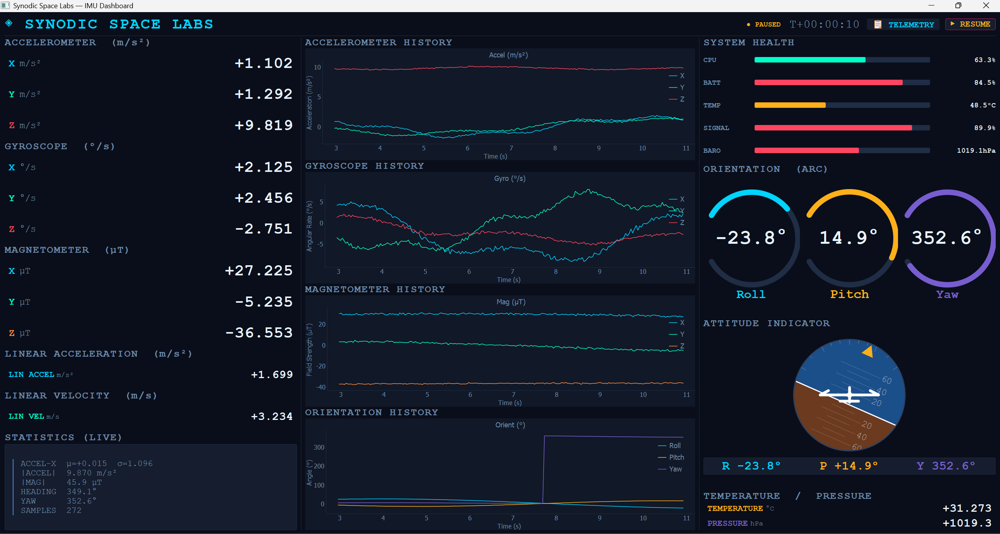
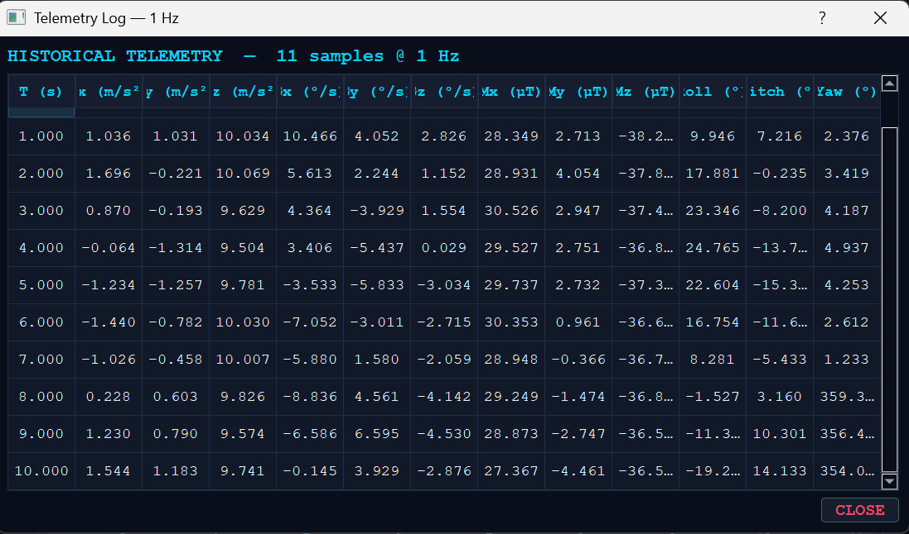

# IMU Dashboard — Synodic Space Labs

A real-time 9-DOF IMU telemetry dashboard built with PyQt5. Visualises simulated sensor data from an Inertial Measurement Unit including accelerometer, gyroscope, magnetometer, orientation, attitude, and system health — all updating live at ~25 fps.

## Demo

<video src="demo.avi" controls width="720"></video>

---

## Tech Stack

| Component | Library / Version |
|---|---|
| GUI Framework | PyQt5 >= 5.15 |
| Real-time Plots | pyqtgraph >= 0.13 |
| Numerical Processing | numpy >= 1.21 |
| Language | Python 3.8+ |
| Rendering | QPainter (custom widgets), OpenGL-accelerated plots |

All UI elements — value cards, arc gauges, bar indicators, attitude indicator — are drawn with PyQt5's `QPainter` API. No external UI files or Qt Designer used.

---

## Project Structure

```
imu_dashboard/
├── main.py           # Full application — single file, self-contained
├── record_demo.py    # Screen recorder for demo video
├── requirements.txt  # Python dependencies
└── README.md         # This file
```

---

## Setup & Run

```bash
pip install -r requirements.txt
python main.py
```

The window opens maximised and starts streaming simulated data immediately.

To record a demo video, run the dashboard first, then in a second terminal:

```bash
pip install opencv-python pillow pyautogui
python record_demo.py
```

This records 30 seconds to `demo.avi`. Press Ctrl+C to stop early.

---

## Dashboard Layout

The dashboard is divided into three columns separated by vertical dividers.



### Left Column — Sensor Readings

Live numeric value cards for every sensor axis, updating at 25 Hz.

| Section | Channels | Unit | Description |
|---|---|---|---|
| Accelerometer | X, Y, Z | m/s² | Raw linear acceleration including gravity |
| Gyroscope | X, Y, Z | °/s | Angular velocity around each axis |
| Magnetometer | X, Y, Z | µT | Earth magnetic field components |
| Linear Acceleration | scalar \|a\| | m/s² | Magnitude of acceleration with gravity removed |
| Linear Velocity | scalar \|v\| | m/s | Estimated speed via leaky integration of linear accel |
| Statistics (Live) | — | — | Running mean, std dev, heading, sample count |

Each card shows the axis label, unit, and current value. X/Y/Z axes are colour-coded: cyan / teal / red respectively. Magnetometer Z uses orange to distinguish it.

### Centre Column — Time-Series Graphs

Four rolling history plots, each showing the last 200 samples (~8 seconds at 25 Hz).

| Graph | Y-Axis | Channels | Colour |
|---|---|---|---|
| Accelerometer History | Acceleration (m/s²) | X, Y, Z | Cyan, Teal, Red |
| Gyroscope History | Angular Rate (°/s) | X, Y, Z | Cyan, Teal, Red |
| Magnetometer History | Field Strength (µT) | X, Y, Z | Cyan, Teal, Orange |
| Orientation History | Angle (°) | Roll, Pitch, Yaw | Cyan, Yellow, Purple |

All graphs share the same X-axis: elapsed time in seconds. Each graph has:
- Labelled X and Y axes
- Subtle grid lines (8% opacity)
- In-graph legend (top-right corner)
- Anti-aliased rendering

### Right Column — Orientation & System State

| Section | Description |
|---|---|
| System Health | 5 bar indicators: CPU %, Battery %, Temperature °C, Signal %, Barometric Pressure hPa |
| Orientation (Arc) | Three arc gauges for Roll (±90°), Pitch (±90°), Yaw (0–360°) |
| Attitude Indicator | Artificial horizon with aircraft silhouette, pitch ladder, roll ring, RPY readout strip |
| Temperature / Pressure | Live scalar cards for onboard IMU temperature (°C) and barometric pressure (hPa) |

---

## Sensor Data Specifications

### Accelerometer
- Range: approximately ±2 m/s² lateral, Z anchored to gravity (9.81 m/s²)
- Noise: Gaussian σ = 0.08 m/s²
- Simulation: superimposed sine waves at 0.8 Hz and 3.1 Hz + noise
- Real-world equivalent: MPU-6050, ICM-42688-P (±16g range)

### Gyroscope
- Range: approximately ±10 °/s
- Noise: Gaussian σ = 0.3 °/s
- Simulation: multi-frequency sinusoids (0.5, 0.7, 0.3 Hz) + noise
- Real-world equivalent: MPU-6050, BMI088 (±2000 °/s range)

### Magnetometer
- Total field magnitude: ~54 µT (Earth field range: 25–65 µT)
- X/Y components rotate with yaw heading, Z ≈ −38 µT (northern hemisphere downward component)
- Noise: Gaussian σ = 0.5 µT
- Simulation: field vector rotated by integrated yaw angle
- Real-world equivalent: AK8963 (in MPU-9250), LIS3MDL

### Orientation
- Roll: ±25° sinusoidal at 0.4 Hz
- Pitch: ±15° sinusoidal at 0.55 Hz
- Yaw: integrated from gyro Z-axis (continuous 0–360°)
- Noise: Gaussian σ = 0.2° on Roll and Pitch

### Linear Acceleration
- Computed as magnitude of (accel − gravity vector)
- Represents motion-induced acceleration only, gravity removed
- Unit: m/s²

### Linear Velocity
- Estimated via leaky integrator: `v = v × 0.98 + |lin_accel| × dt`
- Decay factor 0.98 prevents unbounded drift
- Unit: m/s

### Temperature
- Baseline: 28°C (IMU chip at rest)
- Variation: ±6°C sinusoidal at 0.05 Hz
- Noise: Gaussian σ = 0.2°C
- Note: real IMU chips typically run 40–85°C under load

### Barometric Pressure
- Baseline: 1013.25 hPa (sea level standard)
- Variation: ±8 hPa sinusoidal at 0.08 Hz (~64m altitude swing)
- Noise: Gaussian σ = 0.15 hPa

---

## Attitude Indicator

The artificial horizon is a custom `QPainter`-rendered widget that mimics a real aircraft Primary Flight Display (PFD):

- Sky (blue `#1B4F8A`) and ground (brown `#6B3A1F`) fill the ball, rotating with roll and shifting vertically with pitch
- White horizon line (3px) marks the sky/ground boundary
- Pitch ladder lines at every 10°, labelled at every 20°
- Roll tick marks on the outer ring at ±10°, ±20°, ±30°, ±45°, ±60°
- Yellow triangle pointer on the ring rotates with roll angle
- White aircraft silhouette (fuselage, wings, tail, centre dot) fixed at centre
- RPY readout strip below the ball: R (cyan), P (yellow), Y (purple)

---

## System Health Indicators

Each bar indicator uses a three-state colour system:

| State | Colour | Meaning |
|---|---|---|
| Normal | Teal / Cyan / Yellow / Purple | Within safe operating range |
| Warning | Yellow | Approaching threshold |
| Critical | Red | Exceeded safe limit |

| Metric | Normal Range | Warning | Critical |
|---|---|---|---|
| CPU | 0–70% | 70% | 90% |
| Battery | 30–100% | 30% | 15% |
| Temperature | 20–60°C | 60°C | 75°C |
| Signal | 30–100% | 30% | 15% |
| Barometric | 900–999 hPa | 999 hPa | 980 hPa |

---

## Telemetry Log

Click the `📋 TELEMETRY` button in the header to open the historical telemetry table.



- Data is logged at exactly **1 Hz** (one row per elapsed second)
- The table updates in real time while open (refreshes every second)
- Auto-scrolls to the latest row
- Columns: T (s), Ax, Ay, Az (m/s²), Gx, Gy, Gz (°/s), Mx, My, Mz (µT), Roll, Pitch, Yaw (°)
- After 60 seconds: 60 rows. After 5 minutes: 300 rows.

---

## Controls

| Control | Action |
|---|---|
| `⏸ PAUSE` / `▶ RESUME` | Freeze or resume live data stream |
| `📋 TELEMETRY` | Open historical telemetry table |
| Window resize | All panels, fonts, and gauges scale proportionally |

---

## Responsive UI

The dashboard is fully responsive and adapts to any window or screen size without scrolling.

- All three columns use `QSizePolicy.Expanding` so they stretch to fill available space
- Value cards, arc gauges, bar indicators, and the attitude indicator all scale proportionally with the window
- Fonts are recalculated on every `resizeEvent` using a `scaled()` helper that maps base sizes relative to a 1400×860 reference resolution
- The attitude indicator circle radius adjusts dynamically so it always fits within its allocated space with consistent padding
- The window opens maximised by default (`showMaximized()`) to use the full screen immediately
- Minimum window size is enforced so no widget ever collapses below a readable size

---

## Colour Reference

| Colour | Hex | Used For |
|---|---|---|
| Cyan | `#00D4FF` | X-axis, Roll, primary accent |
| Teal | `#00FFC8` | Y-axis, Pitch |
| Red | `#FF4560` | Z-axis, critical alerts |
| Yellow | `#FEB019` | Pitch gauge, warnings, pause button |
| Purple | `#775DD0` | Yaw gauge |
| Orange | `#FF8C42` | Magnetometer Z |

---

## Data Simulation

All data is generated synthetically in `IMUSimulator.step()` using superimposed sine/cosine waves at different frequencies plus Gaussian noise. No external hardware or files required.

To replace with real hardware data, swap the `self.sim.step(dt)` call in `IMUDashboard._tick()` with your own serial (e.g. `pyserial`) or UDP read routine returning the same tuple structure:

```python
accel, gyro, mag, orient, lin_accel, vel, temp, pressure = your_hardware_read()
```

---

## Dependencies

```
PyQt5>=5.15.0
pyqtgraph>=0.13.0
numpy>=1.21.0
```

Install with:

```bash
pip install -r requirements.txt
```
